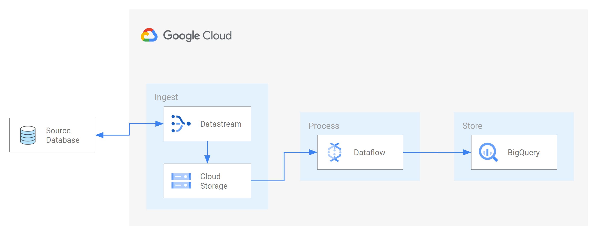

# Terraform: GCP Datastream, Dataflow, and BigQuery Pipeline

This project provisions a scalable, real-time data analytics pipeline on Google Cloud Platform using Terraform.

It automates the deployment of a Change Data Capture (CDC) system that streams data from a Cloud SQL for MySQL source to BigQuery. It uses Google Cloud Storage (GCS) as an intermediary staging area and a Dataflow streaming job for processing.

This architecture is based on the official Google Cloud reference architecture for enriching and transforming CDC data.

## Overall Architecture Diagram


> *Image Source: [Implementing Datastream and Dataflow for real-time analytics](https://cloud.google.com/datastream/docs/implementing-datastream-dataflow-analytics)*

## Architecture

1.  **VPC & Subnets**: A custom VPC is created with dedicated subnets for application infrastructure and a PSC (Private Service Connect) endpoint.
2.  **Cloud NAT**: A Cloud NAT gateway is configured for the private subnets, allowing resources without public IP addresses (like Dataflow workers) to securely access the internet for necessary external communications.
3.  **Cloud SQL for MySQL**: A private instance acts as the transactional database source. It has **no public IP** and is not directly exposed to the internet. Two users are created: `rdsadmin` for management and `datastream` for the CDC service.
4.  **Datastream Private Connection**: A Datastream private connection is configured. This uses Private Service Connect (PSC) technology to establish a secure and private network path from the Datastream service to the project's VPC, allowing it to communicate with the Cloud SQL instance.
5.  **Datastream**: Connects to the Cloud SQL instance securely over the private connection, using the instance's **private IP address** directly. It uses a dedicated `datastream` user to capture changes (CDC) and writes them as Avro files to a GCS bucket.
6.  **PSC Endpoint for In-VPC Access**: A separate PSC endpoint (Forwarding Rule) is also created. This provides a stable internal IP address for other applications or services *within the same VPC* (like a GCE VM or a bastion host) to connect to the Cloud SQL instance.
7.  **Google Cloud Storage (GCS)**: A staging bucket receives the raw CDC events from Datastream.
8.  **Pub/Sub & GCS Notifications**: When new data lands in the GCS bucket, a notification is automatically sent to a Pub/Sub topic.
9.  **Dataflow**: A streaming job, subscribed to the Pub/Sub topic, is triggered by these notifications. It reads the new data from GCS, processes it, and loads it into BigQuery.
10. **BigQuery**: The final destination for the processed data, ready for analytics.
11. **Private Networking**: All components communicate securely over the private VPC network, without exposing any service to the public internet.

## Prerequisites

1.  **Terraform**: Version v1.5.7 or later installed.
2.  **Google Cloud SDK**: `gcloud` CLI installed and authenticated.
3.  **GCP Project**: A Google Cloud project with billing enabled.
4.  **APIs**: The Service Usage API (`serviceusage.googleapis.com`) should be enabled. The Terraform code will enable the rest of the required APIs.
5.  **Terraform State Bucket**: You must create a GCS bucket beforehand to store the Terraform state files.
    ```sh
    gsutil mb -p <YOUR_GCP_PROJECT_ID> gs://tfstate-<YOUR_GCP_PROJECT_ID>
    gsutil versioning set on gs://tfstate-<YOUR_GCP_PROJECT_ID>
    ```

## Directory Structure

-   `terraform/environments/`: Contains configurations for each deployment environment (e.g., `dev`). This is the entrypoint for running Terraform commands.
-   `terraform/modules/`: Contains reusable infrastructure modules.
    -   `network/`: Provisions the VPC, subnets, and a Cloud NAT.
    -   `datastream-gcs/`: Provisions the data source (Cloud SQL with `rdsadmin` and `datastream` users), PSC endpoint, Private DNS Zone, the GCS staging bucket, Pub/Sub topic, and the Datastream stream.
    -   `dataflow-bigquery/`: Provisions the BigQuery dataset, a service account for the job, a Pub/Sub subscription, and the Dataflow streaming job.
-   `terraform/environments/dev/terraform.tfvars.example`: A template for the variables you need to configure for the `dev` environment.

## Configuration

1.  **Update Backend Configuration**:
    In `terraform/environments/dev/main.tf`, update the `backend "gcs"` block with the name of the GCS bucket you created for Terraform state.

    ```terraform
    terraform {
      backend "gcs" {
        bucket = "tfstate-<YOUR_GCP_PROJECT_ID>" # <-- UPDATE THIS
        prefix = "gcp-datastream-dataflow-analytics/terraform"
      }
    }
    ```

2.  **Create a Variables File**:
    In the `terraform/environments/dev` directory, copy the example variables file.

    ```sh
    cp terraform/environments/dev/terraform.tfvars.example terraform/environments/dev/terraform.tfvars
    ```

3.  **Update Variables**:
    Edit `terraform/environments/dev/terraform.tfvars` and replace the placeholder values. You must set `project_id`. The network variables (`public_subnet_cidr`, `private_subnet_cidr`, `datastream_psc_subnet_cidr`) and DNS variables have sensible defaults but can be changed if needed.

## Deployment

1.  **Navigate to the environment directory**:
    ```sh
    cd terraform/environments/dev
    ```

2.  **Initialize Terraform**:
    This will download the necessary providers and configure the backend.
    ```sh
    terraform init
    ```

3.  **Plan the deployment**:
    This will show you what resources Terraform will create. Review the plan carefully.
    ```sh
    terraform plan
    ```

4.  **Apply the configuration**:
    This will provision all the GCP resources. Type `yes` when prompted.
    ```sh
    terraform apply
    ```

## Outputs

After a successful `apply`, Terraform will output the following values:

-   `admin_user_name`: The username for the Cloud SQL admin user (`rdsadmin`).
-   `admin_user_password`: The password for the `rdsadmin` user (marked as sensitive).
-   `cloud_sql_instance_name`: The name of the provisioned Cloud SQL instance.
-   `cloud_sql_instance_private_ip`: The private IP address of the provisioned Cloud SQL instance.
-   `datastream_user_name`: The username for the Cloud SQL user for Datastream (`datastream`).
-   `datastream_user_password`: The password for the `datastream` user (marked as sensitive).
-   `datastream_stream_name`: The name of the created Datastream stream.
-   `gcs_staging_bucket_name`: The name of the GCS bucket used for staging CDC data.

## Optional: Applying Changes to a Specific Module

In some cases, such as for quick testing or recovering from a failed apply, you may want to apply changes to a single module instead of the entire infrastructure. You can do this using the `-target` flag.

**Warning**: This is a powerful feature that should be used with caution. It can lead to configuration drift and state inconsistencies because it ignores dependencies between modules. It is not recommended for regular workflow.

1.  **Navigate to the environment directory**:
    ```sh
    cd terraform/environments/dev
    ```

2.  **Run `apply` with the `-target` flag**:
    The format is `module.<module_name>`, where `<module_name>` is the name given in the `environments/dev/main.tf` file.

    ```sh
    # Example: Apply only the network module
    terraform apply -target=module.network

    # Example: Apply only the datastream-gcs module
    terraform apply -target=module.datastream-gcs

    # Example: Apply only the dataflow-bigquery module
    terraform apply -target=module.dataflow-bigquery
    ```

## Post-Deployment

After deployment, you must complete a few manual steps.

### 1. Grant SQL Permissions

You need to connect to the newly created Cloud SQL instance to grant permissions. The easiest way to perform this one-time setup is by using **Cloud SQL Studio**.

#### a. Get Admin Password

First, retrieve the generated admin password from the Terraform output. From the `terraform/environments/dev` directory, run:
```bash
terraform output admin_user_password
```

#### b. Connect via Cloud SQL Studio

1.  Open the [Cloud SQL instances page](https://console.cloud.google.com/sql/instances) in the GCP Console.
2.  Find your instance (e.g., `mysql-src-ds`) and click its name.
3.  From the left menu, select **"Cloud SQL Studio"**.
4.  Log in with the username `rdsadmin` and the password from the previous step. The database name is `testdb`.

#### c. Execute the GRANT Command

In the Cloud SQL Studio query editor, run the following SQL commands:
```sql
GRANT REPLICATION SLAVE, SELECT, REPLICATION CLIENT ON *.* TO 'datastream'@'%';
FLUSH PRIVILEGES;
```

> **Note on Connecting from Your VPC**
> 
> For connections from your applications, scripts, or bastion hosts inside the VPC, you should use the stable **Private Service Connect (PSC) endpoint**. This provides a private, internal IP address for your Cloud SQL instance.
> 
> Get the connection details from the `terraform/environments/dev` directory:
> ```bash
> # Use this stable internal IP for your applications
> terraform output cloud_sql_psc_endpoint_ip
> 
> # Use this password for the 'rdsadmin' user
> terraform output admin_user_password
> ```
> You would then connect using a standard MySQL client to the IP address provided by the `cloud_sql_psc_endpoint_ip` output.

### 2. Start the Stream

The Datastream stream is created in a `NOT_STARTED` state. You must manually start it. For example:
<pre>
gcloud datastream streams update <i>{datastream_stream_name}</i> \
    --location=us-central1 \
    --state=RUNNING
</pre>

## Testing the Pipeline with Fake Data

After the infrastructure is deployed and the stream is running, you can insert sample data to verify the pipeline.

1.  **Navigate to the scripts directory**:
    ```bash
    cd ../../../scripts 
    # (If you are in terraform/environments/dev)
    ```

2.  **Setup the Python environment**:
    Follow the instructions in `scripts/README.md` to set up the `uv` virtual environment and install dependencies.

3.  **Generate SQL statements**:
    ```bash
    uv run python generate_fake_sql.py --generate-ddl --max-count 1000 > sample_data.sql
    ```

4.  **Import the SQL data via Cloud SQL Studio**:
    The simplest way to import the data is to use Cloud SQL Studio again.
    a. Connect to your database in Cloud SQL Studio as described in the "Post-Deployment" section.
    b. Open the `sample_data.sql` file in a text editor and copy its contents.
    c. Paste the SQL into the query editor and click **"Run"**.

5.  **Verify in GCS**:
    After a few minutes, you should see Avro files appearing in your GCS staging bucket. The files will be organized in a hierarchical path structure based on the source table and the timestamp of the data capture.

    The format will be:
    `gs://<gcs_staging_bucket_name>/cdc-data/<database>_<table>/YYYY/MM/DD/HH/mm/<file_name>.avro`

    For example:
    `gs://gcp-ds-df-analytics-staging-bucket/cdc-data/testdb_retail_trans/2025/08/26/10/37/b74053d03b75_mysql-cdc-binlog_1984077301_2_0.avro`

6.  **Verify in BigQuery**:
    After a few minutes, you should see a new dataset (e.g., `sales_analytics_temp`) and a `retail_trans_log` table in your BigQuery project. Query the table to confirm that the data has been replicated.

## Cleanup

To avoid incurring ongoing charges, destroy the infrastructure when you are finished.

1.  **Stop the Datastream Stream**:
    Before running `terraform destroy`, you must manually stop the Datastream stream. This prevents deletion errors. You can get the `datastream_stream_name` from the Terraform output.

    <pre>
    gcloud datastream streams update <i>{datastream_stream_name}</i> \
        --location=us-central1 \
        --state=PAUSED
    </pre>

2.  **Navigate to the environment directory**:
    ```sh
    cd terraform/environments/dev
    ```

3.  **Destroy the resources**:
    Type `yes` when prompted.
    ```sh
    terraform destroy
    ```

## Known Issues

- **Dataflow Template and MySQL Version Conflict**:
  - The `Datastream_to_BigQuery` template (as of version '2025-08-19-00_RC00') does not support GTID-based replication from MySQL sources. More details can be found in this [GitHub issue](https://github.com/GoogleCloudPlatform/DataflowTemplates/issues/2688).
  - Conversely, MySQL 8.4 exclusively supports GTID-based replication and has deprecated binary log file position-based replication.
  - This creates an incompatibility. Therefore, to use this project's architecture, you must use a MySQL version that supports binary log file position-based replication (e.g., 5.7, 8.0 to 8.3). For more information on supported versions, see the [official Datastream documentation](https://cloud.google.com/datastream/docs/sources-mysql#versionsformysqlsourcedb).

## References

- [Implementing Datastream and Dataflow for real-time analytics](https://cloud.google.com/datastream/docs/implementing-datastream-dataflow-analytics)
- [Google Cloud Dataflow Provided Templates Documentation](https://cloud.google.com/dataflow/docs/guides/templates/provided-templates)
- [GoogleCloudPlatform/DataflowTemplates GitHub Repository](https://github.com/GoogleCloudPlatform/DataflowTemplates)
